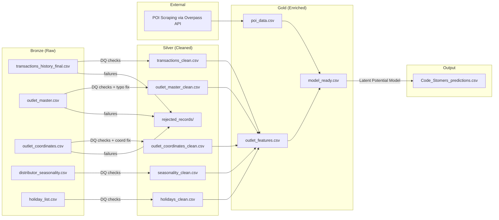

# 🏗️ Architecture — DataStorm 7.0 Lakehouse Pipeline

> **Team**: Code_Stomers  
> **Competition**: DataStorm v7.0 – Storming Round (Preliminary)  
> **Deadline**: May 17, 2026 — 06:00 AM IST  
> **Last updated**: May 15, 2026

---

## 1. High-Level Architecture

We follow a **Medallion / Lakehouse** pattern with three layers:

```
┌─────────────────────────────────────────────────────────────────────────┐
│                        DATA STORM 7.0 PIPELINE                        │
│                                                                        │
│  ┌──────────┐      ┌──────────┐      ┌──────────┐      ┌───────────┐  │
│  │  BRONZE   │ ──► │  SILVER   │ ──► │   GOLD    │ ──► │ PREDICTION │  │
│  │ (Raw)     │     │ (Cleaned) │     │ (Enriched)│     │  (Output)  │  │
│  └──────────┘      └────┬─────┘      └──────────┘      └───────────┘  │
│                         │                                              │
│                    ┌────▼──────┐                                       │
│                    │ REJECTED  │                                       │
│                    │ RECORDS   │                                       │
│                    │ (Quarantine)                                      │
│                    └───────────┘                                       │
│                                                                        │
│  ┌────────────────────────────┐                                        │
│  │  EXTERNAL: POI SCRAPING   │ ──► feeds into GOLD layer              │
│  │  (OpenStreetMap / Overpass)│                                        │
│  └────────────────────────────┘                                        │
└─────────────────────────────────────────────────────────────────────────┘
```

---

## 2. Directory Structure

```
Code_Stomers_Data-Storm-7.0/          ← repo root (pushed to GitHub)
│
├── .gitignore                        ← excludes bronze/, silver/, gold/, *.csv, *.parquet
├── README.md                         ← end-to-end run instructions
│
├── docs/                             ← reference documentation (pushed to Git)
│   ├── architecture.md               ← THIS FILE
│   ├── guidelines.md                 ← coding standards & team conventions
│   └── solution_and_targets.md       ← methodology, math framework, deliverable targets
│
├── scripts/                          ← all Python scripts (pushed to Git)
│   ├── dq_checks.py                  ← reusable DQ framework (imported by all scripts)
│   ├── 01_bronze_ingest.py           ← raw ingestion (copy-only, no transforms)
│   ├── 02_silver_clean.py            ← DQ checks, cleaning, quarantine
│   ├── 03_poi_scraping.py            ← external POI data from OpenStreetMap
│   ├── 04_gold_feature_engineering.py← feature engineering, model-ready dataset
│   ├── 05_latent_potential_model.py  ← censored demand model + predictions
│   └── config.py                     ← shared paths, constants, parameters
│
├── bronze/                           ← RAW data as-is (LOCAL ONLY — gitignored)
│   ├── transactions_history_final.csv
│   ├── outlet_master.csv
│   ├── outlet_coordinates.csv
│   ├── distributor_seasonality_details.csv
│   └── holiday_list.csv
│
├── silver/                           ← CLEANED data (LOCAL ONLY — gitignored)
│   ├── transactions_clean.csv
│   ├── outlet_master_clean.csv
│   ├── outlet_coordinates_clean.csv
│   ├── seasonality_clean.csv
│   ├── holidays_clean.csv
│   └── rejected_records/             ← quarantined records with failure reasons
│       ├── transactions_rejected.csv
│       ├── outlet_master_rejected.csv
│       └── outlet_coordinates_rejected.csv
│
├── gold/                             ← ENRICHED model-ready data (LOCAL ONLY — gitignored)
│   ├── outlet_features.csv           ← final feature matrix per outlet
│   ├── poi_data.csv                  ← scraped POI counts per outlet
│   └── model_ready.csv               ← joined dataset ready for modeling
│
├── output/                           ← final deliverables
│   └── Code_Stomers_predictions.csv  ← Outlet_ID + Maximum_Monthly_Liters
│
└── raw_extract/                      ← original zip extraction (gitignored)
    └── ...original files...
```

---

## 3. Layer Definitions

### 3.1 Bronze Layer (Raw Ingestion)

| Rule | Detail |
|------|--------|
| **Purpose** | Preserve the original data exactly as provided |
| **Transformations** | NONE — byte-for-byte copy from `raw_extract/` to `bronze/` |
| **Script** | `01_bronze_ingest.py` |
| **Output** | Exact copies of the 5 CSV files in `bronze/` |

### 3.2 Silver Layer (Cleaned + Quarantined)

| Rule | Detail |
|------|--------|
| **Purpose** | Apply all DQ checks, clean data, quarantine failures |
| **Key Principle** | **Nothing is silently dropped** — every rejected record goes to `rejected_records/` with a documented `DQ_Failure_Reason` |
| **Script** | `02_silver_clean.py` |
| **DQ Framework** | `dq_checks.py` — reusable, parameterizable functions |
| **Outputs** | Clean CSVs in `silver/`, rejected CSVs in `silver/rejected_records/` |

**DQ Checks Applied per Dataset:**

| Dataset | Checks |
|---------|--------|
| `transactions` | Duplicate (composite key), Null (mandatory fields), Referential Integrity (Outlet_ID, Distributor_ID), Value Range (Volume ≥ 0, realistic bounds), Format (ID patterns), Outlier (IQR on volume & bill) |
| `outlet_master` | Duplicate (Outlet_ID), Null (Outlet_Size), Format (Outlet_ID pattern), Standardize typos (Bakry→Bakery, Grocry→Grocery, " Eatery"→"Eatery", "small"→"Small") |
| `outlet_coordinates` | Null, Swapped lat/lon detection & fix, Zero coordinate detection, Sri Lanka bounds (lat 5.9–9.9, lon 79.4–82.0) |
| `seasonality` | Duplicate, Null, Format, Referential Integrity (Distributor_ID) |
| `holidays` | Duplicate, Null, Date format parsing |

### 3.3 Gold Layer (Enriched + Feature Engineering)

| Rule | Detail |
|------|--------|
| **Purpose** | Produce model-ready feature matrix at the **outlet level** |
| **Inputs** | All Silver-layer datasets + external POI data |
| **Script** | `04_gold_feature_engineering.py` |
| **Grain** | One row per `Outlet_ID` |

### 3.4 External Data (POI Scraping)

| Rule | Detail |
|------|--------|
| **Purpose** | Enrich outlet profiles with nearby Points of Interest |
| **Source** | OpenStreetMap Overpass API (free, no auth required) |
| **Script** | `03_poi_scraping.py` |
| **POI Categories** | Schools, hospitals, bus stops, banks, restaurants, places of worship, shops, tourist attractions |
| **Method** | Batch query by outlet coordinate clusters (radius-based) |
| **Output** | `gold/poi_data.csv` — POI counts per outlet within configurable radius |

---

## 4. Data Flow Diagram



---

## 5. Script Execution Order

Run these in strict sequence — each depends on the previous:

```bash
# Step 1: Copy raw files to bronze (no transforms)
python scripts/01_bronze_ingest.py

# Step 2: Clean data, quarantine failures to silver
python scripts/02_silver_clean.py

# Step 3: Scrape POI data from OpenStreetMap (can run in parallel with Step 2)
python scripts/03_poi_scraping.py

# Step 4: Feature engineering → gold layer
python scripts/04_gold_feature_engineering.py

# Step 5: Build latent potential model → predictions
python scripts/05_latent_potential_model.py
```

**Total pipeline runtime estimate**: ~15–30 minutes (mostly POI scraping)

---

## 6. Key Design Decisions

| Decision | Rationale |
|----------|-----------|
| **Python scripts over Jupyter notebooks** | More reproducible, easier to run end-to-end via CLI, cleaner Git history |
| **CSV over Parquet for intermediate layers** | Simplicity, easy inspection, small enough dataset (20K outlets) |
| **Shared `config.py`** | All paths, constants, and parameters in one place — change once, apply everywhere |
| **`dq_checks.py` as importable module** | Every DQ check is a reusable function — same check logic across all 5 datasets |
| **Rejected records store** | Never silently drop data — every quarantined record has a `DQ_Failure_Reason` column |
| **Overpass API for POI** | Free, no API key, comprehensive global coverage, supports radius queries |

---

## 7. Technology Stack

| Component | Tool |
|-----------|------|
| Language | Python 3.12 |
| Data Manipulation | pandas, numpy |
| Statistical Modeling | scipy (Tobit/censored regression), scikit-learn |
| POI Scraping | requests + Overpass QL (OpenStreetMap) |
| Version Control | Git + GitHub |
| Report | PDF (generated or manual) |

---

## 8. What Gets Pushed to GitHub

✅ **Pushed**: `scripts/`, `docs/`, `README.md`, `.gitignore`, `output/Code_Stomers_predictions.csv`  
❌ **NOT pushed**: `bronze/`, `silver/`, `gold/`, `raw_extract/`, any `*.csv` data files (except final predictions)
